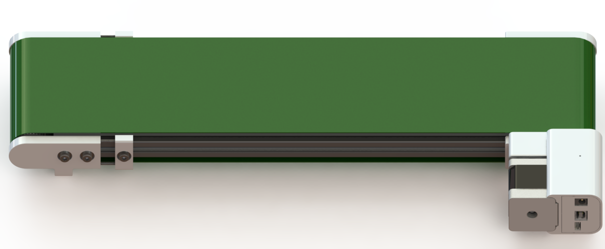

# Conveyor-X-Firmware

`Conveyor X` is a product of `IMWI Technology Company`. It was open source in March 2020.

## Specifications

|Parameter   |Details |
|------------|----------|
|Length      |500/1000mm|
|Width       |120mm     |
|Max speed   |2m/s      |
|Max acceleration|5m/s2 |
|Power Supply|12VDC-2A  |
|Connection  |USB to TTL|
|Baudrate    |115200    |
|Control     | G-code, Potentiometer |

## [G-Codes](https://docs.deltaxrobot.com/reference/gcodes/gc_conveyor/)

All g-code to control `Conveyor X` was listed at [https://docs.deltaxrobot.com](https://docs.deltaxrobot.com/reference/gcodes/gc_conveyor/), visit us for more information.